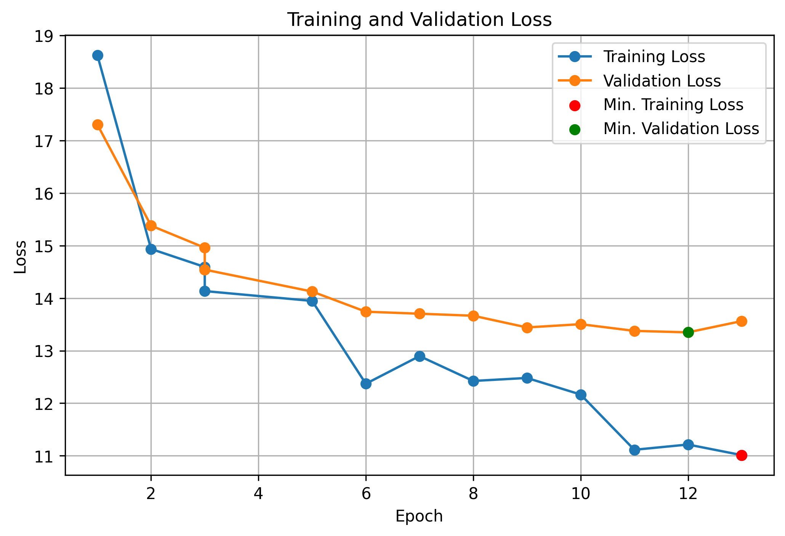
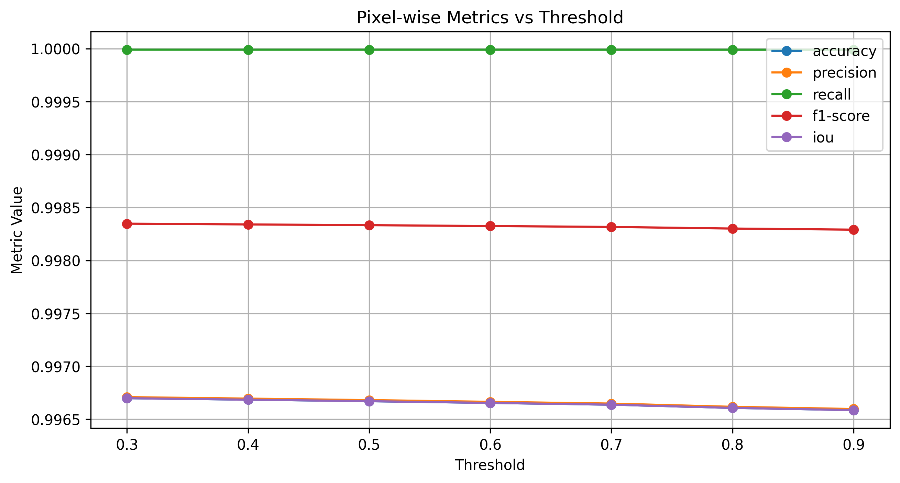
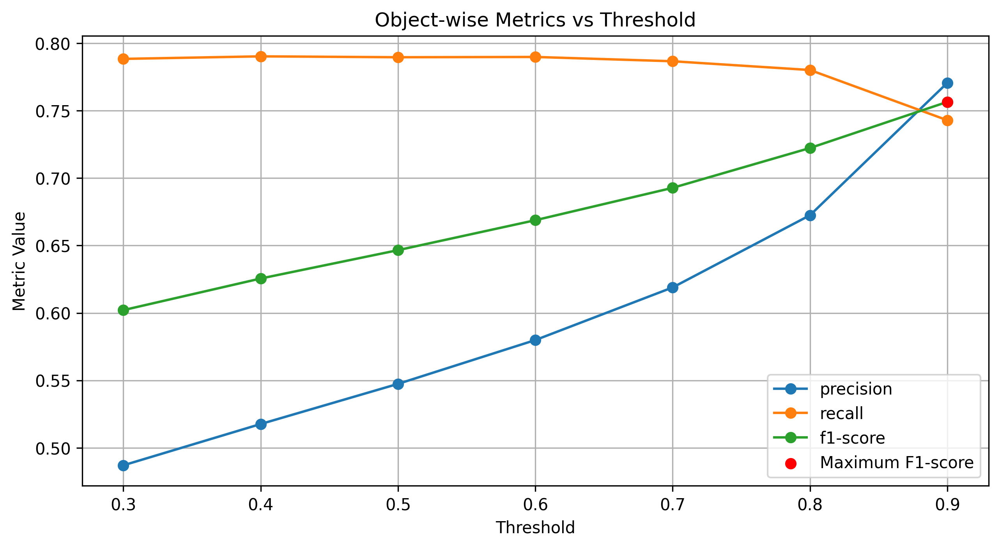

# building-extraction

## Task Summary

This task focuses on the **automatic extraction of building footprints** from **satellite imagery**, a fundamental component of urban Geographic Information Systems (GIS). The objective is to accurately detect and outline buildings despite variations in **shape, color, size**, and **environmental conditions** across different regions.

A key challenge lies in achieving **strong generalization** from limited training data. The provided dataset covers the **Tokyo area**, while testing extends to other regions in Japan. Models must therefore maintain high accuracy and adaptability under diverse geographic and visual conditions.

- **Competition and Data**
	- [Kaggle challenge and COCO-format dataset](https://www.kaggle.com/competitions/building-extraction-generalization-2024/overview)
		- Includes training data from the Tokyo area and evaluation on other regions

- **Hugging Face Resources**
    - [Profile](https://huggingface.co/tomascanivari)
    - Datasets and Models:
        - [Converted Dataset](https://huggingface.co/datasets/tomascanivari/buildings-extraction-coco-hf)
        - [Final Model](https://huggingface.co/tomascanivari/mask2former-swin-large-coco-instance-finetuned-buildings)

### Objective
Develop a **reliable, cost-effective, and scalable** approach for **nationwide building footprint extraction**, demonstrating strong **transferability** and **real-world applicability**.

### Challenge Evaluation Metrics

The evaluation is based on the **object-wise F1-score**, which measures the accuracy of extracted building footprints.

Each extracted building (predicted polygon) is compared with the ground-truth (GT) building polygon using the **Intersection over Union (IoU)** metric — the ratio of the overlapping area to the combined area of both polygons.

- A prediction is considered **correct (True Positive, TP)** if its **IoU ≥ 0.5** with a GT building.  
- Predictions with **IoU < 0.5** or without a corresponding GT are counted as **False Negatives (FN)**.  
- Any **extra or incorrect** extracted buildings are treated as **False Positives (FP)**.  

$\text{Precision} = \frac{TP}{TP + FP}$

$\text{Recall} = \frac{TP}{TP + FN}$

$\text{F1-score} = \frac{2 \times \text{Precision} \times \text{Recall}}{\text{Precision} + \text{Recall}}$

The final ranking is determined by the **average F1-score** over the test set (unweighted). The highest-scoring model achieves the best overall performance.

## Methodology

I approached this task in three steps:

1. **Dataset Preparation**: described in `nb_00_dataset_preparation.ipynb`.
2. **Model Training**: described in `nb_01_mask2former_train.ipynb`.
3. **Model Inference and Evaluation**: described in `nb_02_mask2former_inference_evaluation.ipynb`.

### Dataset Preparation

From the original **COCO-format** annotations and images, a new dataset ([Converted Dataset](https://huggingface.co/datasets/tomascanivari/buildings-extraction-coco-hf)) was created containing both **images** and **annotation mask images**.

Each mask encodes:
- **Semantic segmentation** — stored in the **Red channel**  
  - `0`: background  
  - `1`: building  
- **Instance segmentation** — stored in the **Green channel**  
  - `0`: background  
  - `1...N`: individual building instances  

These masks were generated from the COCO-format polygon annotations.  
The resulting dataset is **ready-to-use** for most **instance segmentation tasks**, as it provides both:
- COCO-format annotations  
- Image–Mask pairs  

Together, these two formats ensure compatibility with a wide range of segmentation frameworks and pipelines.

### Model Training

I started the approach to this challenge by using a **Mask R-CNN** model from the **Detectron2** framework. I also tried a semantic segmentation transformer approach **SegFormer**. In the end, I chose to proceed with **Mask2Former**.

1. **Mask R-CNN:**
	- **Pros:**
		- Easy to implement (used the COCO-format annotations directly).
	 	- Fast to train (lighter architecture).
	  	- Fast deployment. 
	- **Cons:**
		- Acceptable performance (achieved 0.51251 in the test set).
2. **SegFormer:**
	- **Pros:**
		- Newer approach using transformers.
  		- Relatively fast to train.
    - **Cons:**
   		- More complex to implement as it needs dataset manipulation and carefull input pre-processing.
     	- Only **semantic segmentation**, achieving a good **pixel-wise** evaluation but a bad **object-wise** evaluation as it was hard to correctly identify the different buildings.
      	- Worse performance (achieved 0.29089 in the test set, with a very good post-processing to identify buildings).
3. **Mask2Former:**
	- **Pros:**
		- State-of-the-Art approach using transformers.
  		- Universal segmentation (semantic, instance and panoptic).
    	- Best performance (achieved 0.5679 in the test set).
    - **Cons:**
   		- More complex to implement as it needs dataset manipulation and carefull input pre-processing..
     	- Slow to train.

The **Mask2Former** approach is clearly explained in the `nb_01_mask2former_train.ipynb` file:

1. Load the HF dataset.
2. Create a PyTorch dataset compatible with the `mask2former` format and data augmentation.
3. Load the processor and model for the `facebook/mask2former-swin-large-coco-instance` pre-trained model.
4. Finetune for 13 epochs using the hyper-parameters described on the file (time constraints).
5. Upload to HF the [Final Model](https://huggingface.co/tomascanivari/mask2former-swin-large-coco-instance-finetuned-buildings).

The best model was from epoch 12 as seen in the following train and validation loss by epoch:

### Model Inference and Evaluation

Step by step in the `nb_02_mask2former_inference_evaluation.ipynb` file:

1. Load the HF dataset, processor and model.
2. Define **pixel-wise** and **object-wise** metrics.
3. Do a grid-search on different model score thresholds with the `object-wise F1-score` metric as the target.
4. Evaluate test set with the best threshold (0.9) and submit.

In the next plots the **pixel-wise** and **object-wise** metrics are represented for the different thresholds, and justify why threshold=0.9 was chosen:

Both **pixel-wise** and **object-wise** metrics were evaluated, as they capture fundamentally different aspects of model performance. The **pixel-wise metrics** assess how accurately the model distinguishes between `0: background` and `1...N: building` at the individual pixel level. As observed, the model performs exceptionally well in identifying whether a given pixel belongs to a building or not.  

In contrast, **object-wise metrics** evaluate performance on a building-by-building basis, which is a much more challenging task. For example, if the model were to merge two ground-truth buildings into a single prediction, it could still achieve near-perfect pixel-wise scores, yet fail completely in object-wise evaluation because it did not correctly identify each individual building. As seen, with the increase in the threshold the **recall** dropped slightly, as some ground-truths could be missed (higher **FN**), but the **precision** increased much more, since a lot of fake predictions were discarder (lower **FP**), and as such the target metric **F1-score** achieved its maximum at threshold=0.9.

This submission achieved 0.5679 on the Kaggle challenge, a notable decrease in relation to the validation score. This happens due to the difference in context of the samples (very different regions of Japan). A way to improve the test score, would be to augment the train and validation sets with samples from these locations (for example, getting the data from OpenStreetMap).

## Other Methodologies Tried

Apart from the process already described for the **Mask2Former**, I also implemented other models train and inference (code not reviewd, just for reference) but they performed worse as explained in the pros and cons section.
I also tried to augment the dataset with images and annotations from other areas (not from japan) ([summer-dataset](https://universe.roboflow.com/winter-buildings-instance-segmentation-cv/summer-v14)). However, it lead to worse results in the test split. Probably, the same approach but with images from across Japan, and finetuned for a longer time would result in better results.

